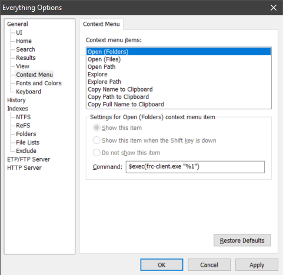

# FAR Remote Control Plugin

This is an extension for the [FAR Manager][FAR], mainly designed to integrate FAR with [Everything], a very fast file search tool for Windows. 

## Concept and Integration

The integration is achieved by implementing a [FAR plugin](plugin/plugin.c) and a [client executable](client/client.c). The client executable can submit path names to the plugin by means of a [mailslot], and the plugin will then navigate to this path in the active FAR panel. In particular, you can integrate Everything into FAR this way:



### Design Problem 
A difficulty in FRC design is the fact that only one FAR instance at a time can be the mailslot server, so the commands send from an Everything search will cause a navigation to occur only in the FAR instance whose FRC plugin has currently registered the mailslot.

### Sneaky Solution
The plugin has a convenience feature that solves this problem. When the FRC plugin is called from a Macro as follows:

```lua
local FRC = "5846B0A6-E130-4B20-8FDD-5CCD70C860BD" -- FRC GUID
Plugin.Call(FRC, "everything.exe")
```

Then the plugin will use `ShellExecuteW` to call `everything.exe`. **However**, it will *first* attempt to silently shut down any *other* FRC server by sending it the filename `NUL`, which serves as a magic sequence to request shutdown of an FRC server.

The user experience for this feature is quite simple: When you use the provided [LUA Macro](plugin/everything-integration.lua) for integration, then you can simply press <kbd>Ctrl</kbd>+<kbd>E</kbd> in the FAR instance you are currently using, an Everything search will pop up and you can search for files. When you press <kbd>Enter</kbd>, the FAR instance from which the search was initiated will navigate to the selected folder, and it has also become the active FRC server.

For further customization, note that you can pass commandline parameters to the plugin call as well:

```lua
Plugin.Call(FRC, "everything.exe", "-close") 
```

## FRC Plugin Interface 

The FRC interface in FAR is quite simplistic. You can call FRC via <kbd>F11</kbd> from the plugins menu. This will allow you to start and stop the FRC server manually through a sequence of prompts.

## FRC Client Interface

There quite frankly is none. The executable is called with a path name as its first and only parameter. The executable writes this path (as a wide character string) to the mailslot `\\.\mailslot\FRC` and that's about it. Have a look at [client.c](client/client.c), there really isn't much going on.

## Expectable Questions

> Does FRC work with file names as well? What does it do?

Yes, it works like the `goto:` command in FAR. When the plugin reads a file name (not a directory name) from the mailslot, it will try to navigate to its parent folder and move the cursor to the file.

> Why did you implement `memset` in [`memset32.asm`](plugin/memset32.asm) and [`memset64.asm`](plugin/memset64.asm)?

Quite frankly, I mostly did it in ASM because it was fun. The reason I wanted to implement memset at all is so that I could compile the project with [`/NODEFAULTLIB`][NODEFAULTLIB] and create really tiny binaries. And that's just something I like to do.

> I want to write a FAR plugin and I understand most of what is going on here, but where did you get `plugin.hpp`?

It is [`plugins/common/unicode/plugin.hpp`][plugin.hpp] from the [FAR Project on GitHub][GitHubFAR] and as FAR as I can tell, that's the way to do it. ¯\\\_(ツ)_/¯

> Why don't you just use the [LiveFileSearch] plugin? It's a great plugin and does a much better job of being properly integrated into FAR!

All true. Sadly, it does not update the run count in Everything and I really wanted that. 


[mailslot]: https://en.wikipedia.org/wiki/MailSlot
[Everything]: https://voidtools.com/
[FAR]: https://www.farmanager.com/
[LiveFileSearch]: https://plugring.farmanager.com/plugin.php?l=ru&pid=931
[GitHubFAR]: https://github.com/FarGroup/FarManager
[plugin.hpp]: https://github.com/FarGroup/FarManager/blob/master/plugins/common/unicode/plugin.hpp
[NODEFAULTLIB]: https://docs.microsoft.com/en-us/cpp/build/reference/nodefaultlib-ignore-libraries