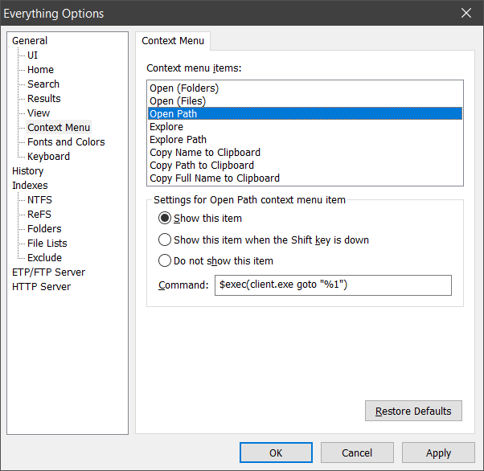

# FAR Remote Control Plugin

This is an extension for the [FAR Manager][FAR], mainly designed to integrate FAR with [Everything], a very fast file search tool for Windows. 

## Concept and Integration

The integration is achieved by implementing a [FAR plugin](plugin/plugin.c) and a [client executable](client/client.c). The client executable can submit path names to the plugin by means of a [mailslot], and the plugin will then navigate to this path in the active FAR panel. In particular, you can integrate Everything into FAR this way:



Here, the client command `goto` is used, which instructs the FRC plugin to perform a navigation as outlined above. The client also supports the commands `copy` and `qcpy` which insert the second argument as a string into the FAR command line, where `qcpy` also wraps the string in double quotes if it contains spaces, which may be useful for inserting path names. 

### Design Problem 
A difficulty in FRC design is the fact that only one FAR instance at a time can be the mailslot server, so the commands send from an Everything search will cause a navigation to occur only in the FAR instance whose FRC plugin has currently registered the mailslot.

### Sneaky Solution
The plugin has a convenience feature that solves this problem. When the FRC plugin is called from a Macro as follows:

```lua
local FRC = "5846B0A6-E130-4B20-8FDD-5CCD70C860BD" -- FRC GUID
Plugin.Call(FRC, "everything.exe")
```

Then the plugin will use `ShellExecuteW` to call `everything.exe`. **However**, it will *first* attempt to silently shut down any *other* FRC server by sending a termination command to the existing mailslot.

The user experience for this feature is quite simple: When you use the provided [LUA Macro](plugin/everything-integration.lua) for integration, then you can simply press <kbd>Ctrl</kbd>+<kbd>E</kbd> in the FAR instance you are currently using, an Everything search will pop up and you can search for files. When you press <kbd>Enter</kbd>, the FAR instance from which the search was initiated will navigate to the selected folder, and it has also become the active FRC server.

For further customization, note that you can pass commandline parameters to the plugin call as well:

```lua
Plugin.Call(FRC, "everything.exe", "-close") 
```

## Recommended Setup

My recommended setup is the following:

- Use the provided [LUA Macro](plugin/everything-integration.lua) for integration.
- In the `General` &rarr; `Context Menu` section of *Everything*, configure the following commands:
  - `$exec(client.exe goto "%1")` for `Open (Folders)` and `Open Path`.
  - `$exec(client.exe qcpy "%1")` for `Explore Path`
- In the `General` &rarr; `Keyboard` section of *Everything*, set up following shortcuts:
  - <kbd>Shift</kbd>+<kbd>Enter</kbd> for `File | Open`
  - <kbd>Ctrl</kbd>+<kbd>Enter</kbd> for `File | Explore Path`
  - <kbd>Enter</kbd> for `File | Open Path`

This allows you to launch an Everything search from FAR by pressing <kbd>Ctrl</kbd>+<kbd>E</kbd>, and then navigate to any result by simply selecting it and pressing <kbd>Enter</kbd>. In order to insert the search results as a (possibly quoted) path to the FAR command line, you can use <kbd>Ctrl</kbd>+<kbd>Enter</kbd> instead. Finally, if you want to execut a search result directly, press <kbd>Shift</kbd>+<kbd>Enter</kbd>.

## FRC Plugin Interface 

The FRC interface in FAR is quite simplistic. You can call FRC via <kbd>F11</kbd> from the plugins menu. This will allow you to start and stop the FRC server manually through a sequence of prompts.

## FRC Client Interface

The client executable will provide a list of supported commands when it is executed. The currently supported commands are the following:

- `goto` navigates to the parent directory of the given file or folder and places the cursor on it.
- `into` works as `goto`, but when the argument is a folder then FRC navigates into this folder.
- `copy` inserts the second argument as a string into the FAR command line.
- `qcpy` acts as `copy`, but wraps the string in double quotes if it contains a space character.
- `quit` issues a request for FRC server termination, the second argument is ignored.

The executable currently encodes the command in a rather dirty way by overwriting the high order byte of the first wide character of the data which is sent to the mailslot `\\.\mailslot\FRC`. This is mostly lazines on my part, and should not be a problem in the use cases that FRC is *intended* for. The worst case that can happen is that you try to use `copy` to insert some _"true"_ unicode data into the FAR command line and your first character gets utterly destroyed. Path names should only start with an ASCII character, so there should not be a problem there. Have a look at [client.c](client/client.c#L49-L56) and 
[plugin.c](plugin/plugin.c#L71-L80) to see what exactly is happening.

## Expectable Questions

> Does FRC work with file names as well? What does it do?

Yes, the client's `goto` command works similar to the `goto:` command in FAR; It will navigate to the parent directory of the given file or folder and move the cursor to the item.

> Why did you implement `memset` in [`memset32.asm`](plugin/memset32.asm) and [`memset64.asm`](plugin/memset64.asm)?

Quite frankly, I mostly did it in ASM because it was fun. The reason I wanted to implement memset at all is so that I could compile the project with [`/NODEFAULTLIB`][NODEFAULTLIB] and create really tiny binaries. And that's just something I like to do.

> I want to write a FAR plugin and I understand most of what is going on here, but where did you get `plugin.hpp`?

It is [`plugins/common/unicode/plugin.hpp`][plugin.hpp] from the [FAR Project on GitHub][GitHubFAR] and as FAR as I can tell, that's the way to do it. ¯\\\_(ツ)_/¯

> Why don't you just use the [LiveFileSearch] plugin? It's a great plugin and does a much better job of being properly integrated into FAR!

All true. Sadly, it does not update the run count in Everything and I really wanted that. 

> What in the name of the almighty was your thought process when you decided to interlace the command control with the command argument in such a terrible way?

To do this in a not so awkward way, I'd have to implement a lot more string operations, both in the client and the server. While that is not terribly hard, this was way easier and it works well for me. Feel free to give this a good scrub and submit a PR if it terrifies you ;-).

[mailslot]: https://en.wikipedia.org/wiki/MailSlot
[Everything]: https://voidtools.com/
[FAR]: https://www.farmanager.com/
[LiveFileSearch]: https://plugring.farmanager.com/plugin.php?l=ru&pid=931
[GitHubFAR]: https://github.com/FarGroup/FarManager
[plugin.hpp]: https://github.com/FarGroup/FarManager/blob/master/plugins/common/unicode/plugin.hpp
[NODEFAULTLIB]: https://docs.microsoft.com/en-us/cpp/build/reference/nodefaultlib-ignore-libraries